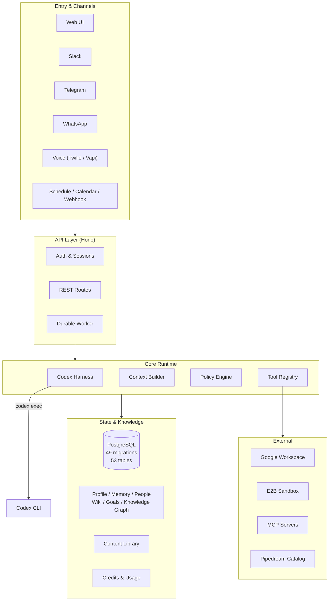

# TownAI Clean-Room

A durable personal AI operating system, reconstructed from publicly observable
behavior of [Town.com](https://www.town.com). This is a clean-room
implementation — it does not contain or extract Town's private source code,
system prompts, or secrets.

The system is built around four pillars: **personal long-term context**,
**durable agent execution**, **tool governance with approval policy**, and
**cross-channel continuity**. It uses the official [Codex SDK](https://github.com/openai/codex)
as the agent harness backend.

## Architecture



## Workspace Structure

```
townai-cleanroom/
├── apps/
│   ├── api/          Hono REST API + durable worker (119 TS files, 89 test files)
│   └── web/          Vanilla JS command center UI
├── packages/
│   ├── contracts/    Shared types, IDs, Zod schemas
│   ├── db/           PostgreSQL schema + 49 migrations
│   ├── identity/     Auth, sessions, OAuth (Google + Microsoft), connected accounts
│   ├── knowledge/    Profile, Memory, People, Wiki, Goals, Knowledge Graph, Context Builder
│   ├── agents/       Agent versions, threads, tasks
│   ├── runtime/      Durable sessions, runs, events, queue leases, worker loop
│   ├── harness/      Codex SDK adapter + Responses API fallback
│   ├── tools/        Tool registry, policy engine, MCP client
│   ├── routines/     Schedules, triggers, step cache, replay, results
│   ├── content/      Content library (10 types), collections, share tokens
│   ├── channels/     Notification delivery (email, webhook, Telegram, WhatsApp, Slack)
│   ├── teams/        Squares, memberships, team policy
│   ├── billing/      Credits, usage ledger, plan state
│   ├── operations/   Audit events, admin diagnostics
│   ├── suggestions/  Need-to-know candidates, dismiss/convert
│   ├── a2a/          Agent-to-agent request/result envelope
│   └── google/       Gmail + Calendar API client
├── docs/
│   ├── PACKAGES.md           Package responsibility reference
│   ├── ARCHITECTURE_GAPS.md  Clean-room vs real Town.ai parity matrix
│   ├── implementation-status.md
│   └── deployment.md
├── api/               Vercel serverless entrypoint
├── scripts/           Build checks, config validation, Vercel setup
└── vercel.json
```

## Quick Start

**Prerequisites:** Node.js 20+, pnpm 10, PostgreSQL 16.

```bash
pnpm install
cp .env.example .env
# Set DATABASE_URL and CREDENTIAL_MASTER_KEY_BASE64URL (32-byte base64url key)
pnpm verify
```

`pnpm verify` runs source checks, lint, typecheck, tests, build, and build-entry
verification. The API applies pending migrations on startup.

### Running the API

```bash
pnpm --filter @town/api build
node apps/api/dist/index.js
```

### Running the worker

Set `WORKER_ENABLED=true` for local development. For serverless deployments,
use `WORKER_SECRET` + `POST /v1/internal/worker` or `CRON_SECRET` with the
Vercel hourly cron in `vercel.json`.

## Configuration

| Variable | Purpose |
|----------|---------|
| `DATABASE_URL` | PostgreSQL connection string (required) |
| `CREDENTIAL_MASTER_KEY_BASE64URL` | 32-byte encryption key for OAuth tokens (required) |
| `CODEX_EXEC_ENABLED` | Use Codex SDK harness instead of Responses API |
| `CODEX_CLI_PATH` | Override path to `codex` binary (auto-detected if on PATH) |
| `CODEX_SANDBOX_MODE` | `read-only` / `workspace-write` / `danger-full-access` |
| `GOOGLE_OAUTH_CLIENT_ID` | Google OAuth (PKCE + offline access) |
| `MICROSOFT_OAUTH_CLIENT_ID` | Microsoft OAuth (Azure AD v2.0) |
| `SLACK_SIGNING_SECRET` | Slack Events API inbound webhooks |
| `TELEGRAM_SECRET_TOKEN` | Telegram Bot webhook verification |
| `WHATSAPP_APP_SECRET` | WhatsApp Cloud API webhook signing |
| `E2B_API_KEY` | E2B sandbox code runner (falls back to local Node runner) |
| `PIPEDREAM_API_KEY` | Pipedream integration catalog proxy |

See [`.env.example`](.env.example) for the full list. Missing credentials
produce explicit `not_configured` states — the system never fabricates data.

## Harness Backends

The agent runtime supports two backends, selected by environment:

- **Codex SDK** (`CODEX_EXEC_ENABLED=true`): Uses `@openai/codex-sdk` which
  spawns the `codex` CLI as a subprocess. The CLI handles model reasoning,
  sandbox execution, approval policies, MCP tool calls, and web search. The
  binary package `@openai/codex` is installed as a dependency; `CODEX_CLI_PATH`
  can override the binary path for deployments where the vendored binary does
  not resolve.

- **Responses API** (`RESPONSES_API_KEY`): Calls the OpenAI Responses API
  directly. Used as the fallback when Codex is not enabled.

Both backends are wired only when their configuration is present. Without either,
runs remain honestly queued.

## Key Design Decisions

- **Durable sessions**: Sessions survive restarts, support pause/resume across
  approvals, and cache completed steps to avoid repeating external side effects.
- **Idempotent tool calls**: Every external action carries a stable idempotency
  key. Approvals freeze the normalized arguments before execution.
- **Trust engine**: Three permission modes (read-only / approval-required /
  autonomous) with per-tool overrides, trusted contact/domain matching, and
  prompt-injection risk detection.
- **Knowledge graph**: 12 node types, 15 edge types, recursive traversal (3 hops).
  Context Builder uses retrieval planning with federated search, deduplication,
  and compression.
- **Source-only policy**: No reverse-engineering captures, credentials, or
  personal data enter this repository. See [`scripts/check-source-only.mjs`](scripts/check-source-only.mjs).

## API Surface

The API exposes 90+ authenticated REST endpoints under `/v1/`. Key namespaces:

| Namespace | Routes |
|-----------|--------|
| Identity | `/v1/auth/session`, `/v1/accounts/*`, `/v1/accounts/{google,microsoft}/oauth/*` |
| Agents | `/v1/agents/personal/*`, `/v1/agents/routines/*` |
| Threads & Tasks | `/v1/threads/*`, `/v1/tasks/*` |
| Sessions | `/v1/sessions/*`, `/v1/sessions/:id/events/stream` (SSE) |
| Knowledge | `/v1/profile`, `/v1/memories`, `/v1/people/*`, `/v1/wiki/*`, `/v1/goals/*`, `/v1/trusted-contacts/*` |
| Routines | `/v1/routines/*`, `/v1/routine-runs/*`, `/v1/routine-results/*` |
| Tools | `/v1/tools`, `/v1/tools/policy/evaluate`, `/v1/approvals/*` |
| Content | `/v1/content/*`, `/v1/content-shares/:token` |
| Channels | `/v1/channels/*` |
| Teams | `/v1/squares/*` |
| Billing | `/v1/billing` |
| Admin | `/v1/admin/{overview,users,teams,agent-health,billing-reconciliation}` |
| Integrations | `/v1/mcp-servers/*`, `/v1/integrations/{slack,telegram,whatsapp}/events/*`, `/v1/integrations/pipedream/apps` |

## Documentation

- [Package Reference](docs/PACKAGES.md) — what each of the 17 packages does
- [Architecture Gaps](docs/ARCHITECTURE_GAPS.md) — clean-room vs real Town.ai parity
- [Implementation Status](docs/implementation-status.md) — evidence ledger
- [Deployment](docs/deployment.md) — Vercel deployment notes

## Verification

```bash
pnpm typecheck   # 18 packages, all pass
pnpm test        # 452 tests, all pass
pnpm build       # workspace build
```

## License

This project is a clean-room reconstruction. It does not use or reproduce
Town's proprietary source code.
